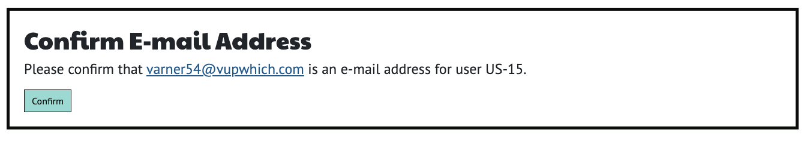
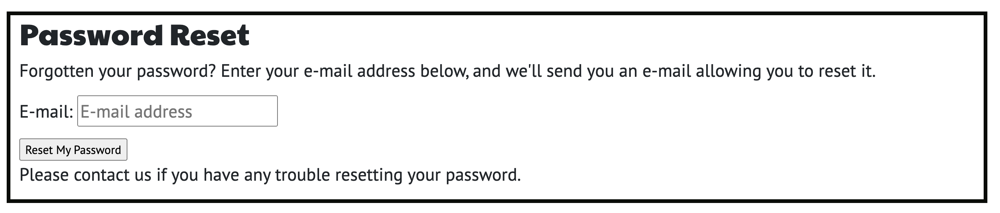
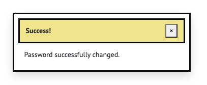

# Manual Testing

## Sign up using email, username and password 
## [Issue #15](https://github.com/mjjstockman/ecomm/issues/15)

The Signup page shows the following form

Form validation

Missing info

Once filled in correctly...

User shown success message and informed to verify email

## Confirm Sign up via email
## [Issue #17](https://github.com/mjjstockman/ecomm/issues/17) 

User recieves an email

If user trys to login before confirming email

## Sign up using Google
## [Issue #16](https://github.com/mjjstockman/ecomm/issues/16)

Google Login button

Google choose account

Google signin success

## Log in using username / password
## [Issue #18](https://github.com/mjjstockman/ecomm/issues/18)

Login form

Logged in message

## Login using username / password
## [Issue #19](https://github.com/mjjstockman/ecomm/issues/19)

Login form

Signedin message

## Forgot password
## [Issue #20](https://github.com/mjjstockman/ecomm/issues/20)

Password reset form

Password reset message

User recieves email

New password form

Password changed message

## Login state
## [Issue #21](https://github.com/mjjstockman/ecomm/issues/21)

nav-anonm

nav-loggedin

loggedin-msg

| Theme | Epic | Related User Stories | MOSCOW | Completed |
|--|--|--|--|--|
| Account Management | Sign up | [#15](https://github.com/mjjstockman/ecomm/issues/15) Sign up using email, username and password | Must have | Yes |
| 					| 			| [#16](https://github.com/mjjstockman/ecomm/issues/16) Sign up using Google | Should have | Yes |
| 					| 			| [#17](https://github.com/mjjstockman/ecomm/issues/17) Confirm Sign up via email | Should have | Yes |
| 					| Sign in | [#18](https://github.com/mjjstockman/ecomm/issues/18) Log in using username / password | Must have | Yes |
| 					| 		  | [#19](https://github.com/mjjstockman/ecomm/issues/19) Login using Google | Should have | Yes |
| 					| 			| [#20](https://github.com/mjjstockman/ecomm/issues/20) Forgot sign in info | Should have | Yes |
| 					| 			| [#21](https://github.com/mjjstockman/ecomm/issues/21) Login state | Should have |  Yes |
| 					| Log out | [#22](https://github.com/mjjstockman/ecomm/issues/22) Manual log out | Must have | Yes |
| 					| 			| [#23](https://github.com/mjjstockman/ecomm/issues/23) Automatic log out | Won't have | No |
| Products | Add products | [#24](https://github.com/mjjstockman/ecomm/issues/24) Add products through admin | Must have | Yes |
| 			| 				| [#20](https://github.com/mjjstockman/ecomm/issues/20) Add products through site | Must have |Yes |
| 			| View products| [#25](https://github.com/mjjstockman/ecomm/issues/25) View all products | Must have |  Yes |
| 			| 			|[#26](https://github.com/mjjstockman/ecomm/issues/26) View products by category | Must have | Yes |
| 			| 			| View new products | Won't have | No |
| 			| 			| [#26](https://github.com/mjjstockman/ecomm/issues/26) Search products | Should have |  Yes |
| 			| Edit products	|  [#27](https://github.com/mjjstockman/ecomm/issues/27) Edit products through site | Must have | Yes |
| 			|  				|  [#37](https://github.com/mjjstockman/ecomm/issues/37) Edit products through Django admin | Must have |  Yes |
| 			| Delete products	| [#38](https://github.com/mjjstockman/ecomm/issues/38) Delete products through admin | Must have | Yes |
| 			|           	| [#28](https://github.com/mjjstockman/ecomm/issues/28) Delete products through site | Must have | Yes |
| Cart	    | Make purchase | [#29](https://github.com/mjjstockman/ecomm/issues/29) Add item to cart | Must have |  Yes |
| 			|  				| [#30](https://github.com/mjjstockman/ecomm/issues/30) Change product quantity in cart | Should have | Yes |
| 			|  				| [#31](https://github.com/mjjstockman/ecomm/issues/31) Remove items from cart | Should have | Yes |
| 			|  				|  [#32](https://github.com/mjjstockman/ecomm/issues/32) See order total | Must have |  Yes |
| 			|  				| [#33](https://github.com/mjjstockman/ecomm/issues/33) Pay for goods | Must have | Yes |
| 			|  				|  [#34](https://github.com/mjjstockman/ecomm/issues/34) Know if an order was successful | Must have | Yes |
| 			|  				| [#35](https://github.com/mjjstockman/ecomm/issues/35) Email order confirmation | Should have | Yes |
| 	Profile |  Details		| [#40](https://github.com/mjjstockman/ecomm/issues/40) Save profile details | Should have | Yes |
|           |           	| [#41](https://github.com/mjjstockman/ecomm/issues/41) Edit profile details | Should have | Yes |
| 			|  				|  [#42](https://github.com/mjjstockman/ecomm/issues/42) View order history | Should have | Yes |
| FAQ		|  				|  [#43](https://github.com/mjjstockman/ecomm/issues/43) Submit a question | Must have | Yes |
|   		|  				|  [#44](https://github.com/mjjstockman/ecomm/issues/44) Submit an answer | Must have | Yes |
|   		|  				|  [#46](https://github.com/mjjstockman/ecomm/issues/46) Email when question answered | Could have | Yes |
| Events	|  				|  [#45](https://github.com/mjjstockman/ecomm/issues/45) See previous events | Should have | Yes |
| Marketing	|  				|  [#36](https://github.com/mjjstockman/ecomm/issues/20) Add Facebook page | Must have | Yes |
