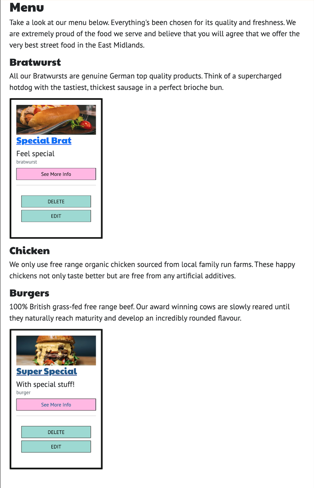
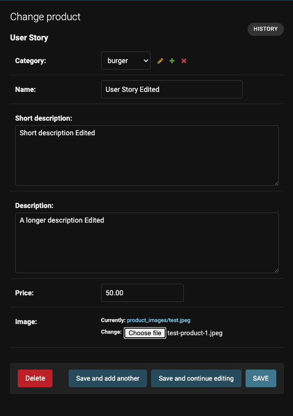
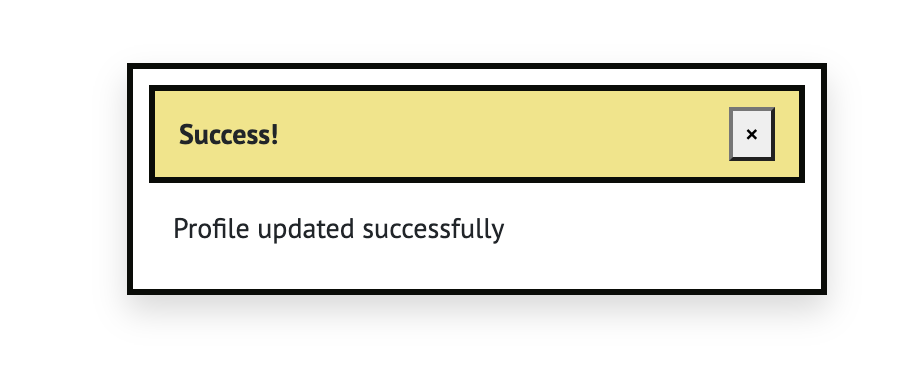
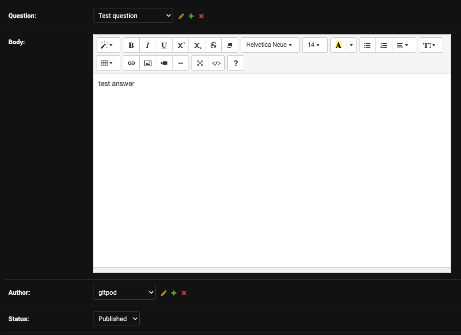

# Manual Testing

## Sign up using email, username and password 
## [Issue #15](https://github.com/mjjstockman/ecomm/issues/15)

The Signup page shows the following form

Form validation

Missing info

Once filled in correctly...

User shown success message and informed to verify email

## Confirm Sign up via email
## [Issue #17](https://github.com/mjjstockman/ecomm/issues/17) 

User recieves an email

If user trys to login before confirming email

## Sign up using Google
## [Issue #16](https://github.com/mjjstockman/ecomm/issues/16)
!!!!!!!!!!!!!!!!!!CHANGE TO LOGIN WITH GOOGLE ISSUE 19 !!!!!!!!!!!!!!!!!!
Google Login button

Google choose account

Google signin success

## Log in using username / password
## [Issue #18](https://github.com/mjjstockman/ecomm/issues/18)

Login form

Login form incorrect details

Logged in message

!!!!!!!!!!!!!!!!!!CHANGE SEE ISSUE 16!!!!!!!!!!!!!!!!!!!
## Login Google
## [Issue ...........](https://github.com/mjjstockman/ecomm/issues/19)

Login form

Signedin message

## Forgot password
## [Issue #20](https://github.com/mjjstockman/ecomm/issues/20)

Password reset form

Password reset message

User recieves email

New password form

Password changed message

## Login state
## [Issue #21](https://github.com/mjjstockman/ecomm/issues/21)

nav-anonm

nav-loggedin

loggedin-msg

## Manual logout
## [Issue #22](https://github.com/mjjstockman/ecomm/issues/22)

Logout success message

## Add products through admin
## [Issue #24](https://github.com/mjjstockman/ecomm/issues/24)

Products in admin before

Products in admin after

Products on site before

Products on site after

## View all products
## [Issue #25](https://github.com/mjjstockman/ecomm/issues/25)

All products on menu page

## View products by category
## [Issue #26](https://github.com/mjjstockman/ecomm/issues/26)

Bratwurts

Chicken

Burgers

## Search products
## [Issue #59](https://github.com/mjjstockman/ecomm/issues/59)

Searching for the term "special"

Products including the term "special"

Searches are case insnesitive

Searches within long desctiption as well

## Edit products through admin
## [Issue #37](https://github.com/mjjstockman/ecomm/issues/37)

Products shown on site before editing a product through admin

Product admin edit form

Products shown on site after editing a product through admin

## Edit products through site
## [Issue #27](https://github.com/mjjstockman/ecomm/issues/27)

Product before editing through site

Product edit form on site

Completed Product edit form on site

Successful Product edit confirmation

Product after editing through site

## Delete product through site
## [Issue #28](https://github.com/mjjstockman/ecomm/issues/28)

Menu before deleting product through site

Confirm Product deletion

Product deletion message

Menu after deleting product through site

## Add product to cart
## [Issue #29](https://github.com/mjjstockman/ecomm/issues/29)

Nav cart empty

Cart empty

Nav cart with item

Cart with item

## Change cart quantities
## [Issue #30](https://github.com/mjjstockman/ecomm/issues/30)

Cart before

Update quantity

Update quantity success message

## Remove from cart
## [Issue #31](https://github.com/mjjstockman/ecomm/issues/31)

Cart before

Cart after removing Double Pigs

## See total cost when placing / confirming order
## [Issue #32](https://github.com/mjjstockman/ecomm/issues/32)

Total cost when placing order

Total cost when confirming order

## Pay for goods
## [Issue #33](https://github.com/mjjstockman/ecomm/issues/33)

Payment form

Payment form complete

## Know if an order was successful
## [Issue #34](https://github.com/mjjstockman/ecomm/issues/34)

Order confirmation sent

Order success message

## Email order confirmation
## [Issue #35](https://github.com/mjjstockman/ecomm/issues/35)

Email sent confirming order

## Facebook page
## [Issue #36](https://github.com/mjjstockman/ecomm/issues/36)

Facebook page

Facebook page shows business info

## Save profile info
## [Issue #40](https://github.com/mjjstockman/ecomm/issues/40)

No profile info saved

Completed profile form

Profile updated message

New profile info

 

## Edit profile info
## [Issue #41](https://github.com/mjjstockman/ecomm/issues/41)

Profile before editing

Completed edit profile form with new values

Profile updated message

New profile info

## View order history
## [Issue #42](https://github.com/mjjstockman/ecomm/issues/42)

View order history

Order history detail

## Submit an question
## [Issue #43](https://github.com/mjjstockman/ecomm/issues/43)

Logged in user can submit a question

Duplicate questions are not allowed

Anonymous users cannot submit a question.

User submitted questions have default submitted status value

Staff submitted questions have default published status value

Questions with submitted status value are not shown on the site

Six questions in admin, but only five are published

Staff can change question status to published 

This adds the question to the site

## Submit an answer
## [Issue #44](https://github.com/mjjstockman/ecomm/issues/44)

Logged in user can submit an answer

Non-logged in user cannot submit an answer and are promted to either Login or Sign Up

User submitted answers have default submitted status value

Staff submitted answers have default published status value

Answers with submitted status value are not shown on the site. There are 2 answers in answers admin
for "question for test"

However only 1 is published so the other does not show.

When staff change other answer to published both answers can be seen.

## View past events
## [Issue #45](https://github.com/mjjstockman/ecomm/issues/45)

The events page shows some events Get Wurst have worked at, with an image, the date
and a link to the events official page.

## Email when question asnwered
## [Issue #46](https://github.com/mjjstockman/ecomm/issues/46)

User can check the checkbox underneath the question field if they wish to recieve an email when
their question gets an approved answer.

The email a user will recieve.

## Can like/unlike answer
## [Issue #60](https://github.com/mjjstockman/ecomm/issues/60)

Logged in user has a thumb icon they can click to like an answer.

Once cliked the thumb icon and the number of likes changes

If clicked again the thumb icon and the number of likes changes back

# Automated Testing

A small portion of the site was created using Test Driven Behaviour.

//////////////////////////////
PRODUCTS MODELS

from django.test import TestCase
from .models import Category, Product

class TestModels(TestCase):
    def test_product_has_a_category(self):
        category1 = Category.objects.create(name='Category 1')
        product1 = Product.objects.create(
            name='Product 1',
            short_description='Prod 1 description',
            description='Prod 1 full description',
            price=1,
            image='media/product_images/test1.png',
            # product1.caterogy=category1,
            category=self.category1
        )

///////////////////////////

PRODUCTS FORMS
# from django.test import TestCase, Client
# from django.core.files.uploadedfile import SimpleUploadedFile
# from products.form import FakeForm
# from products.models import Category

class TestFakeForm(TestCase):
    def setUp(self):
        self.client = Client()
        self.category1 = Category.objects.create(
            name='Category 1',
        )

    def test_fake_form_valid_data(self):
        form = FakeForm(data={
            'name': 'Fake Name 1',
            'category': self.category1,
            'image': SimpleUploadedFile('file.jpg', b"file_content",
                                        content_type='image/jpeg')
        })

        self.assertTrue(form.is_valid())

    /////////////////////

PRODUCT URLS

    # import unittest
# from django.urls import reverse, resolve
# from products.views import all, detail, add, edit, delete

# class TestUrls(unittest.TestCase):

#     def test_products_url_resolves(self):
#         url = reverse('products')
#         self.assertEqual(resolve(url).func, all)

#     def test_product_detail_url_resolves(self):
#         url = reverse('product_detail', args=[1])
#         self.assertEqual(resolve(url).func, detail)

#     def test_add_product_url_resolves(self):
#         url = reverse('add_product')
#         self.assertEqual(resolve(url).func, add)

#     def test_product_edit_url_resolves(self):
#         url = reverse('edit_product', args=[1])
#         self.assertEqual(resolve(url).func, edit)

#     def test_product_delete_url_resolves(self):
#         url = reverse('delete_product', args=[1])
#         self.assertEqual(resolve(url).func, delete)

///////////////////////////

PRODUCT VIEWS

# import unittest
# from django.urls import reverse
# from django.test import TestCase, Client
# from products.models import Category, Product

# class TestViews(TestCase):

#     def setUp(self):
#         self.client = Client()
#         self.category1 = Category.objects.create(
#             name = 'Category 1',
#         )
#         self.products_url = reverse('products')
#         self.products_detail_url = reverse('product_detail', args=[1])
#         self.products_edit_url = reverse('edit_product', args=[1])
#         self.products_delete_url = reverse('delete_product', args=[1])
#         self.product1 = Product.objects.create(
#             name = 'Product 1',
#             short_description = 'Prod 1 description',
#             description = 'Prod 1 full description',
#             price = 1,
#             image = 'media/product_images/test1.png',
#             category = self.category1
#         )

#     def tearDown(self):
#         self.category1.delete()

#     def test_products_all_GET(self):
        
#         response = self.client.get(self.products_url)

#         self.assertEqual(response.status_code, 200)
#         self.assertTemplateUsed('products/all.html')

#     def test_products_detail_GET(self):
       
#         response = self.client.get(self.products_url)

#         self.assertEqual(response.status_code, 200)
#         self.assertTemplateUsed('products/detail.html')

#     needed as used in setup???
#     def test_products_add_POST_adds_new_product(self):
       
#         response = self.client.post(self.products_url)

#         self.assertEqual(response.status_code, 200)
#         self.assertEqual(self.product1.name, 'Product 1')
#         self.assertEqual(self.product1.category, 'Category 1')
#         self.assertTemplateUsed('products/add.html')

#     def test_products_edit_POST_edits_product(self):

#         self.product1.name = 'Edited Product Name'
       
#         response = self.client.post(self.products_edit_url, {
#             'name': 'Edited Product Name'
#         })

#         self.assertEqual(response.status_code, 302)
#         self.assertEqual(self.product1.name, 'Edited Product Name')
#         self.assertTemplateUsed('products/add.html')

#     def test_products_delete_POST_deletes_product(self):

#         self.product1.delete()
        
#         response = self.client.post(self.products_delete_url)

#         self.assertEqual(response.status_code, 302)
#         self.assertEqual(Product.objects.count(), 0)

////////////////////////

FAQ URLS

# from django.test import SimpleTestCase
# from django.urls import reverse, resolve
# from faq.views import faq

# class TestUrls(SimpleTestCase):

#     def test_faq_url_resolves(self):
#         url = reverse('faq')
#         self.assertEqual(resolve(url).func, faq)

/////////////////

EVENTS. test_events.py

import pytest
from events.models import Event

@pytest.fixture()
def event():
    event = Event()
    return event

def test_canAddEventName(event):
    event.addName("Glasto")

def test_canAddEventLink(event):
    event.addLink("https://tramlines.org.uk/")

def test_canAddEventImg(event):
    event.addImg("media/product_images/Screenshot_2022-11-28_at_14.00.\
                  39_78nCoVz.png")

///////////////////

EVENTS MODELS

from django.test import TestCase
from events.models import Event

class TestModels(TestCase):

    def setUp(self):
        self.event = Event()

    def test_can_instantiate_an_event(self):
        self.assertIsInstance(self.event, Event)

    def test_can_add_an_event_name(self):
        self.event.name = 'Glasto'
        self.assertEqual(self.event.name, 'Glasto')

    def test_can_add_an_event_image(self):
        self.event.image = 'image'
        # assert 1 == 2
        self.assertEqual(self.event.image, 'image')

///////////////////////

EVENTS URLs

from django.test import SimpleTestCase
from django.urls import reverse, resolve
from events.views import events

class TestUrls(SimpleTestCase):

    def test_events_url_is_resolved(self):
        url = reverse('events')
        self.assertEqual(resolve(url).func, events)

/////////////////////

EVENTS VIEWS

from django.test import TestCase, Client
from django.urls import reverse

class TestViews(TestCase):

    def test_events_view(self):
        client = Client()

        response = client.get(reverse('events'))

        self.assertEqual(response.status_code, 200)
        self.assertTemplateUsed(response, 'events/events.html')
